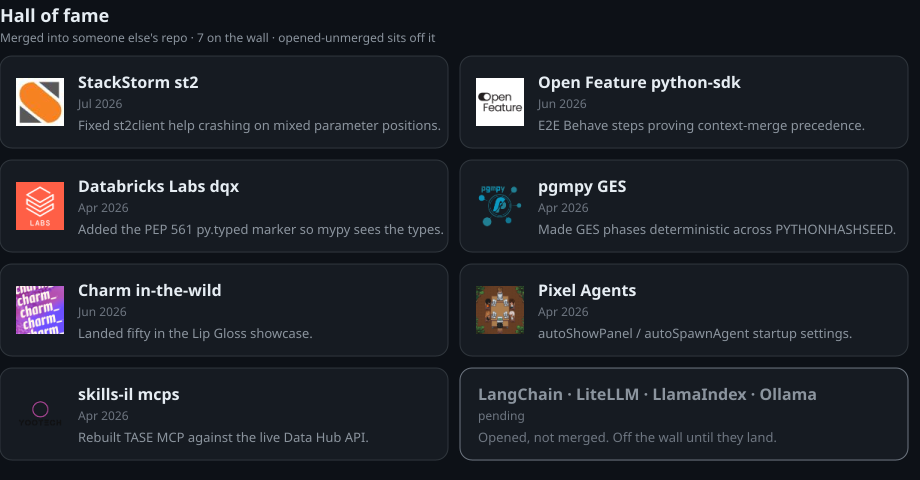
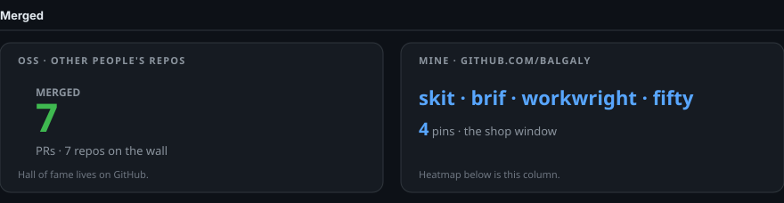
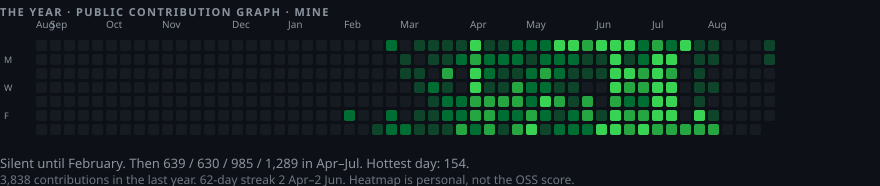

# Snir Balgaly

I build tools that make agent work inspectable. I like making myself obsolete.

[me.balgaly.com](https://me.balgaly.com) · [words](https://words.balgaly.com)

## Hall of fame

Open source landed in other people's repos. Merged only on the wall.

[st2#6375](https://github.com/StackStorm/st2/pull/6375) · [python-sdk#593](https://github.com/open-feature/python-sdk/pull/593) · [dqx#1115](https://github.com/databrickslabs/dqx/pull/1115) · [pgmpy#3303](https://github.com/pgmpy/pgmpy/pull/3303) · [charm-in-the-wild#94](https://github.com/charm-and-friends/charm-in-the-wild/pull/94) · [pixel-agents#221](https://github.com/pixel-agents-hq/pixel-agents/pull/221) · [mcps#2](https://github.com/skills-il/mcps/pull/2)

## Tools I ship

- [skit](https://github.com/balgaly/skit) — package manager for agent skills
- [brif](https://github.com/balgaly/brif) — Claude Code statusline
- [workwright](https://github.com/balgaly/workwright) — Playwright for terminals
- [fifty](https://github.com/balgaly/50-first-sessions) — git catch-up briefs

## Recently

Public GitHub landings only. Opened-unmerged is a number, not a ticker.

- **31 Aug** — merged [tap#1](https://github.com/balgaly/homebrew-tap/pull/1), [registry#2](https://github.com/balgaly/skit-registry/pull/2), [skit#7](https://github.com/balgaly/skit/pull/7) — ship
- **30 Aug** — [skit v1.2.1](https://github.com/balgaly/skit/releases/tag/v1.2.1) — release
- **30 Aug** — [brif v1.2.0](https://github.com/balgaly/brif/releases/tag/v1.2.0) — release
- **17 Jul** — merged [StackStorm/st2#6375](https://github.com/StackStorm/st2/pull/6375) — oss
- **27 Jun** — merged [charm-in-the-wild#94](https://github.com/charm-and-friends/charm-in-the-wild/pull/94) — oss

Snapshot 4 Sep 2026, Jerusalem. No WakaTime, no view counter, no trophies.
